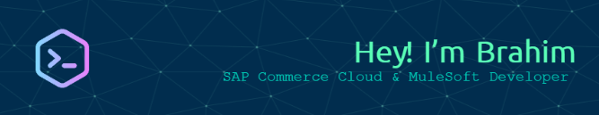

  

### Hi there 👋

I'm **Brahim Bousnguar** — MuleSoft Integrator & SAP Commerce Cloud Consultant,  
now building **AI-augmented integrations**, MCP servers, and LLM-powered workflows.

🎒 **Clients:** SEB · Miele · BYK · Mapal · RocheBobois  
⚙️ **Integration:** SAP Commerce Cloud · MuleSoft Anypoint · Java · Spring Boot · REST APIs  
🤖 **AI:** Python · OpenAI API · Gemini · Ollama · MCP · n8n · Hugging Face  
🛠️ **Tools:** IntelliJ IDEA · Anypoint Studio · Postman · Jenkins · Docker · Git  
🌿 Nature lover | 🎯 Always learning | ⚡ Solution-driven

---

### 🚀 What I Do

- 🛒 **E-commerce:** Building & optimizing SAP Commerce Cloud platforms — SEB, Miele, BYK, Mapal
- 🔗 **API Integration:** MuleSoft Anypoint flows, RAML specs, DataWeave transformations
- 🤖 **AI Automation:** MCP servers, local LLM pipelines (Ollama), AI agents, n8n workflows
- ☁️ **Cloud Architecture:** Microservices, containerization, CI/CD pipelines
- 🔨 **Currently building:** MCP server for Anypoint Platform API management

---

### 🧰 Tech Stack

**Integration & E-commerce**

**AI & Automation**

**DevOps & Tools**

---

### 📊 GitHub Activity

&nbsp;

&nbsp;

---

🤝 **Let's Connect:** [LinkedIn](https://www.linkedin.com/in/brahim-bousnguar) · [Email](mailto:b.bousnguar@gmail.com)

